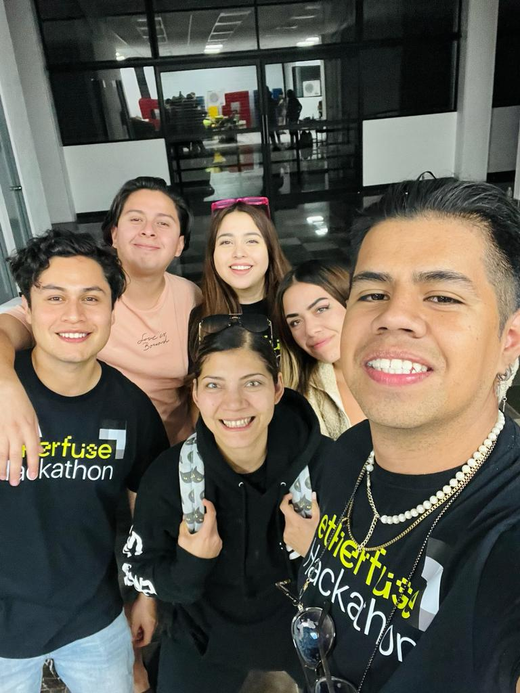

#  Sanwis
La industria restaurantera se recupera de los estragos del COVID-19. Es necesario que haya alternativas rápidas, confiables y libres de comisiones para que más gente pueda aprovechar los beneficios de blockchain.
Sube tu menú en Excel y empieza a cobrar en dólares (USDC). Powered by Solana Pay.

     
    
     

## Links importantes

| ¿Qué? | Link |
|---|---|
| Landing Page | https://sanwis.framer.website |
| App | https://sanwis-solana-hackathon.vercel.app/ |
| Instagram | https://instagram.com/clubsanwis |
| Twitter | https://twitter.com/clubsanwis |
| Tiktok | https://tiktok.com/clubsanwis |
| Branding | https://bit.ly/brandingsanwis |

## ¿Cómo funciona?

1. Llena tu menú con platillos y precios en Excel o Google Sheets.
2. Comienza a cobrar en USDC.
3. Retira tu dinero en cualquier Oxxo del país usando Decaf.

## El team

     
    
     

    

